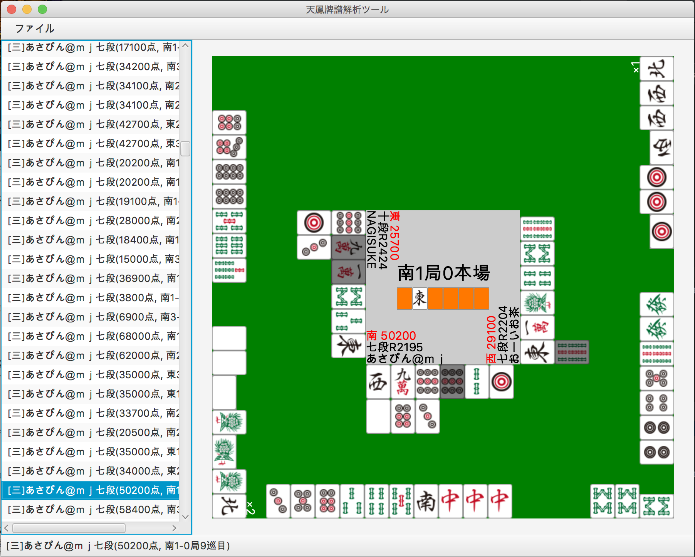

# tenhou-visualizer

- 天鳳の牌譜から特定の場面を抽出するツール
- 現在はシャンテン数が後退した場面抽出のみ
- 実行するにはJavaの実行環境が必要です

[ダウンロード](https://github.com/CrazyBBB/tenhou-visualizer/releases/download/v0.1/tenhouvisualizer.jar)

牌画像は[麻雀豆腐](http://majandofu.com/mahjong-images)さんのものをさせてもらいました

## ライセンス
GNU General Public License v3.0
